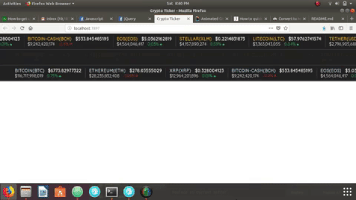

# jQuery Cryptocurrency Ticker Widget - [Demo](https://pkellz.github.io/pk/cryptoticker/)
Customizable jQuery widget that lets you retrieve live prices, market caps, and % changes of cryptocurrencies from the CoinMarketCap API


# Installation
Clone this repository or [download](https://pkellz.github.io/pk/cryptoticker/jquery-cryptocurrency-ticker-widget.zip) the plugin files here.

Include the **latest version of jQuery** in your project:
```html
 <script src="https://code.jquery.com/jquery-3.2.1.js"></script>
```

Include the **jquery.cryptoticker.js** file. Make sure you include it **after** jQuery:

```html
<script src="jquery.cryptoticker.js"></script>
```

Include the **cryptoticker.css** file in your `<head>` tag:

```html
<link rel="stylesheet" href="cryptoticker.css">
```

## Initialize widget
To initialize the widget just insert `$({selector}).cryptoticker();` in your `$(document).ready();` section:

```javascript
$(document).ready(function(){
    $('#tickerDiv').cryptoticker();
});
```
**You may pass a configuration object here:** `$('#tickerDiv').cryptoticker({options});`

## Options

| Option       | Default  | Details   |
|----------------|----------|-----------|
| **id**       | null  | Search for a crypto by id - (**id:"bitcoin"** for example) - can only return one coin at a time  |
| **getTopCoins**      | 10 | return **n** number of coins - overrides **'top5'** and **'top10'** but not **id** |
| **startIndex** | 0 | Index to start at. Index 0 is most likely 'Bitcoin' |
| **top5**  | false | Return top 5 results |
| **top10**   | false | Return top 10 results |
| **speed**       | 30000     | Time in milliseconds until slide animation ends - default 30 seconds |
| **fadeInOutSpeed**    | 2500      | Time in milliseconds it takes to fade out after slide animation ends - default 2.5 seconds, |
| **resetSpeed**       | 1000    | Time in milliseconds it takes for the ticker to reset position after fading out - default 1 second |
| **separatorColor**       | '#999999'     | Default separator color |
| **separatorWidth**       | 5 | Default separator width in px (**Takes in a number, NOT px**)  |
| **nameColor**       | '#2EABC9'     | Default coin name color |
| **priceColor**       | '#ffffff'     | Default price color |
| **capColor**       | '#ffffff'     | Default market cap color |

### Examples
**Be sure to add the ticker class to the div that you want to target or else it won't have any styles!**
```html
<div class="ticker" id="ticker_1"></div>
```

**Your Javascript File**
```javascript
//Default ticker with no options
$('#ticker_1').cryptoticker();
```


```javascript
//Ticker with options
$('#ticker_1').cryptoticker({
    startIndex:5,
    getTopCoins:3,
    nameColor:'yellow',
    separatorColor:'#ddd',
    separatorWidth:10,
    priceColor:'orange'
});
```



You can have multiple tickers that have different options
```html
<div class="ticker" id="ticker_1"></div>
<div class="ticker" id="ticker_2"></div>
```

```javascript
$('#ticker_1').cryptoticker({
    startIndex:0,
    getTopCoins:20,
    nameColor:'yellow',
    separatorColor:'#ddd',
    separatorWidth:10,
    priceColor:'orange'
  });

  $('#ticker_2').cryptoticker({
    startIndex:19,
    getTopCoins:20,
    nameColor:'#44aaff',
    separatorColor:'red',
    separatorWidth:10,
    priceColor:'orange'
  });
```
